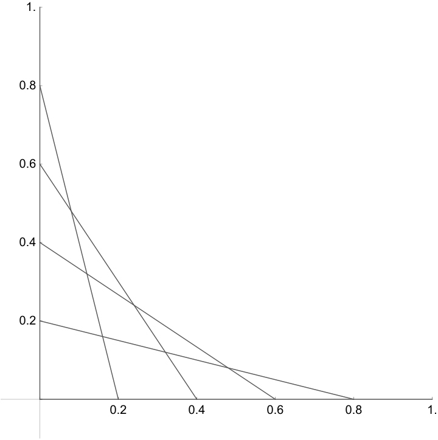
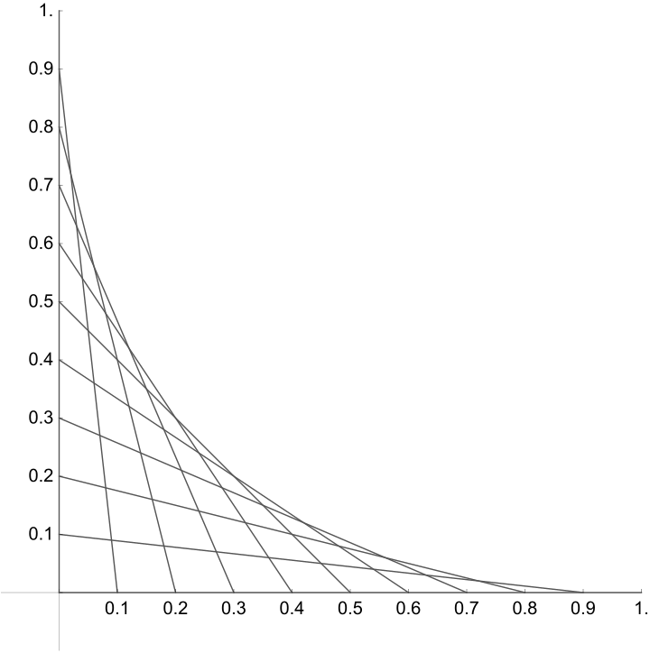
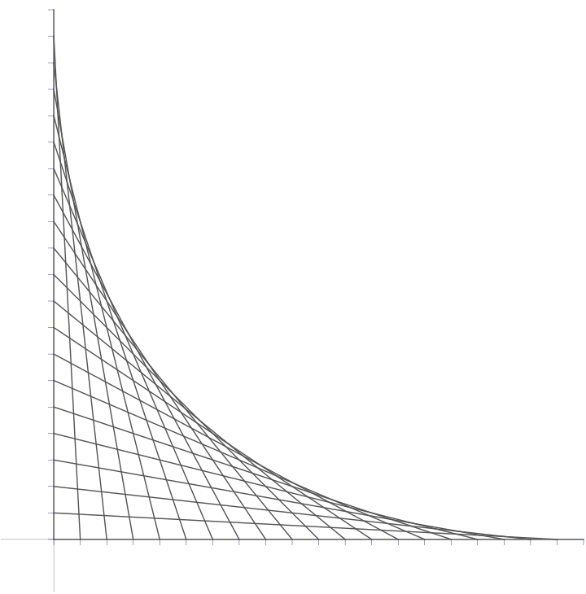
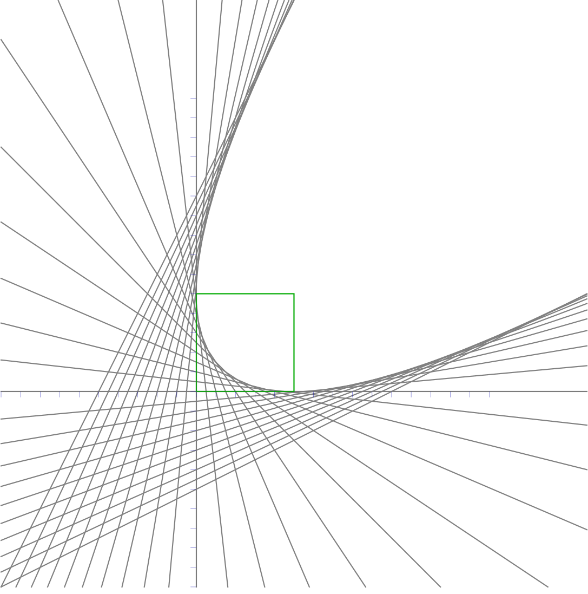
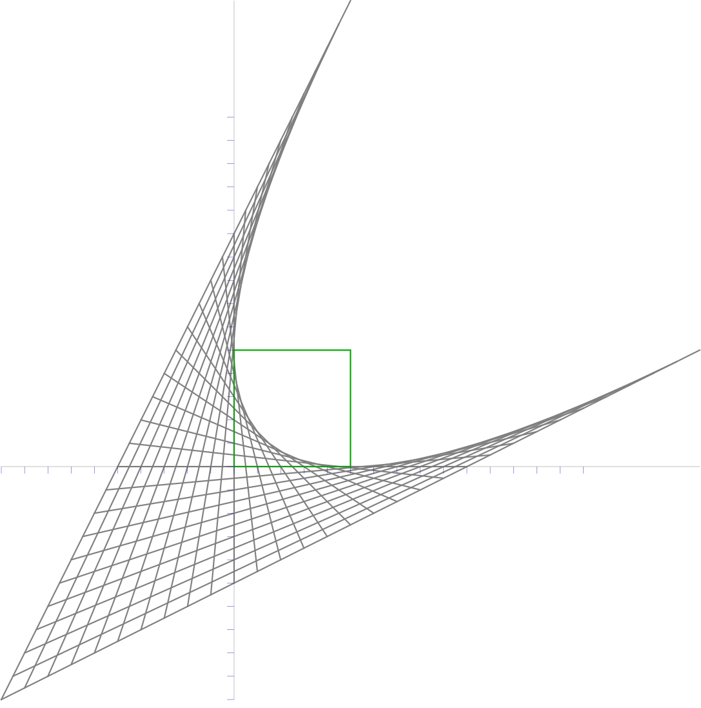
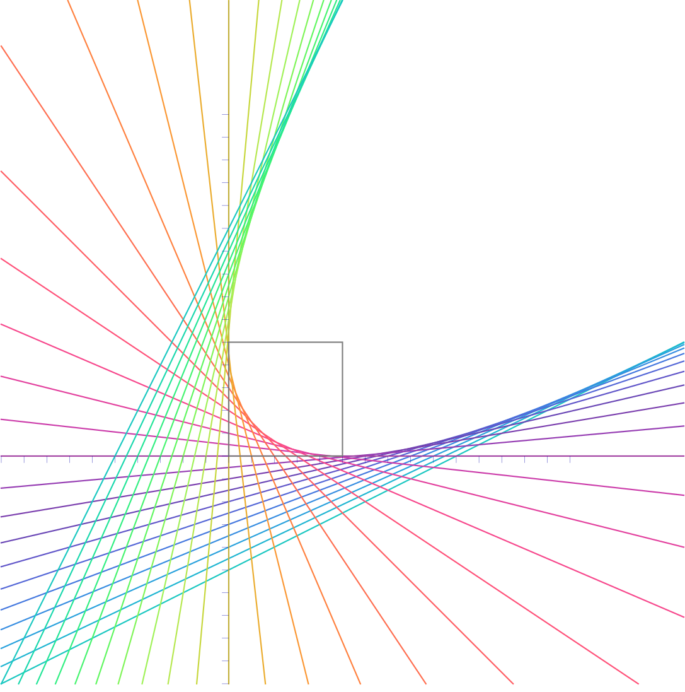
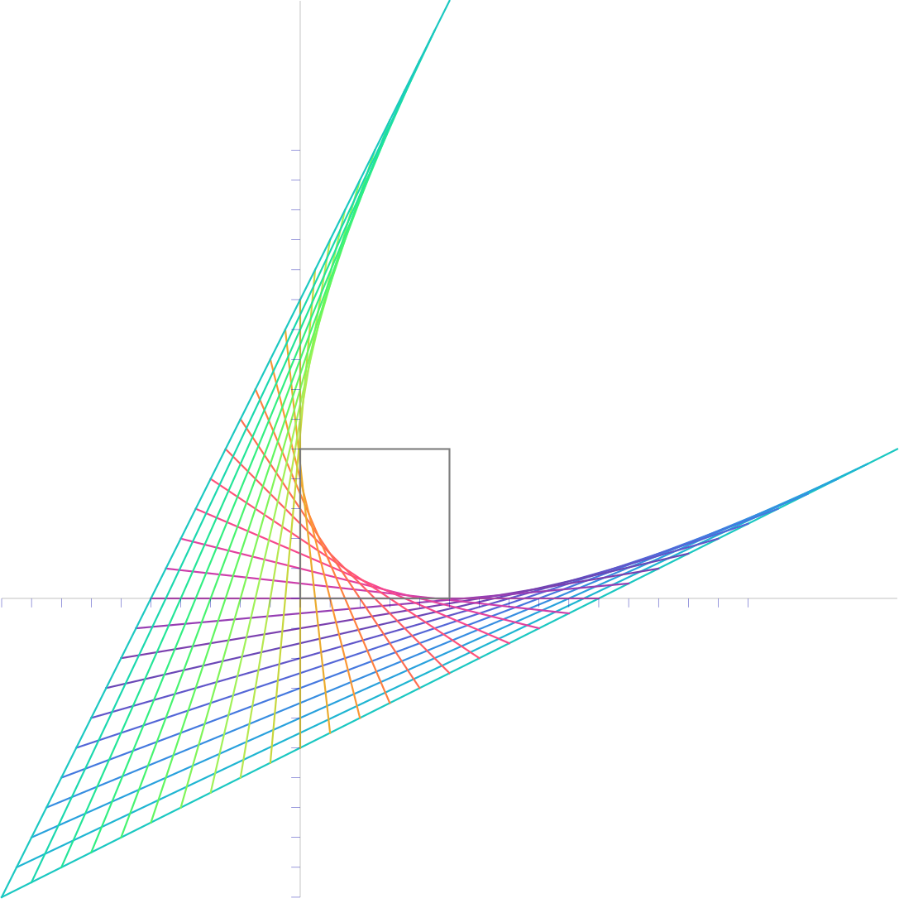

---
html:
  embed_local_images: true
  embed_svg: true
  offline: false
export_on_save:
  html: true
customjs:
  - https://polyfill.io/v3/polyfill.min.js?features=es6
  - https://cdn.jsdelivr.net/npm/mathjax@3/es5/tex-mml-chtml.js
---

# Envelope Curve

---

## The Problem

Check out the following picture:

Looks pretty cool. We can start over with more lines:

As we add more lines, a nice curve starts to emerge:

This leads to our primary question:

**What kind of curve is this?**

One approach is to start by formalizing the kind of thing we're drawing.

## Investigation

Say we're drawing our lines within the 1 by 1 square with one corner at $(0,0)$ and the other at $(1,1)$.

One thing to notice is that the strategy used to draw the lines is to start with a vertical one along the left side of the square,
then shift the top endpoint down by some amount, and the bottom endpoint to the right by the same amount. In the first picture above, we shifted by $0.2$ each time,
and in the second picture, we shifted by $0.1$ units between drawing lines. This leads to the following property:

If we call the endpoints of a line $(0,u)$ and $(v,0)$ then it must have intercepts that satisfy

$$
    u + v = 1
$$

With this observation, there's nothing stopping us from drawing more lines with the same property.
Using values of $u,v$ that are _outside_ the range $[0,1]$ and extending them a little further beyond the points where they intersect the X and Y axes.

Here I've put a green square over the unit square $[0,1] \times [0,1]$, and also took some artistic liberty to change how far the lines extend.
In the second column I drew the lines so that the middle third of each line's length was between its $X$ and $Y$ intercepts.

|                        Infinite lines                         |                   Truncated lines                    |
| :-----------------------------------------------------------: | :--------------------------------------------------: |
|  |  |

The shape starts to emerge! Here's a version with colors:

|                            Infinite lines                             |                       Truncated lines                        |
| :-------------------------------------------------------------------: | :----------------------------------------------------------: |
|  |  |

**At this point** you may have a pretty good idea of what kind of curve this is.
But no guess is satisfactory without a proof to be _absolutely sure_ our parabolic suspicions are correct!

## Analysis

The working theory is that if we draw infinitely many lines, the lines will perfectly trace out the exact curve.

Lets start by thinking about our collection of drawn lines as a family of lines which depend on a time parameter $t$.
Suppose the line for $t$ has the two points $(t,0), (0,1-t)$.
Then it turns out a point $(x,y)$ is on this line if and only if 
$$
   (1 - t) (x - t) + t y = 0
$$
Equivalently,
$$
    t^2-t x+t y-t+x = t^2 - (x-y+1)t + x = 0
$$
Now let $$F(t,x,y)= t^2 - (x-y+1)t + x$$

The easiest way to proceed is to notice that a point $(x,y)$ lies on the curve if and only if there is ***exactly one*** value of $t$ that generates a line that the point lies on.
In this case, for such a special $(x,y)$ value, there's 1 $t$ such that $F(t,x,y)=0$.
If we look at points $(x,y)$ in the open white space, there are no lines through them meaning $0$ t-values that work. And points "behind" the curve have multiple lines (so multiple t-values)
corresponding to solutions to $F(t,x,y)=0$.

Looking at the equation above we can see its a quadratic function of $t$:

$$
    F(t,x,y)=t^2 - (x-y+1)t + x = A t^2 + B t + C
$$

which has a single solution for $t$ if and only if $B^2 - 4 A C = 0$.
In other words:
$$
    (x-y+1)^2 - 4(1)(x) = 0
$$
Expanding:
$$
    x^2 -2xy + y^2 -2x -2y + 1 = 0
$$

which is the equation of the so-called [envelope](https://en.wikipedia.org/wiki/Envelope_(mathematics)) we're looking for!

And using [this property](https://en.wikipedia.org/wiki/Conic_section#Discriminant)
of the conic equation above (with $b=-2, a=c=1$) we have $b^2 - 4 a c = 0$ which means this conic section is a parabola!

And with a little change of variables, (which nicely correspond to a rotation by $45 \deg$, plus a scaling), we can set $u = x+y, v = x-y$ and the equation above becomes:
$$
    0 = (x-y)^2 - 2(x+y) + 1 \longrightarrow v^2 = 2 u - 1
$$
which is also the equation of a parabola in some rotated coordinate system.

